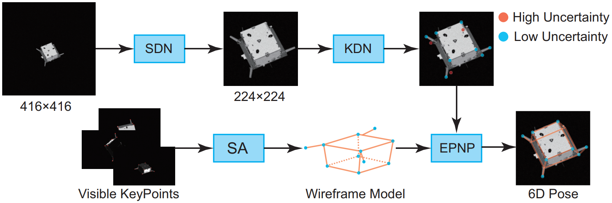

<div align=center>
  
# Learning-Based Pose Estimation of Non-Cooperative Spacecrafts with Uncertainty Prediction
</div>

This is the official implementaion of paper [***Learning-Based Pose Estimation of Non-Cooperative Spacecrafts with Uncertainty Prediction***](https://www.mdpi.com/2226-4310/9/10/592), which is accepted in ***Aerospace 2022***. This repository contains Pytorch training code and evaluation code.

<div align=center>

</div>

<p align="center">The framework of our method.</p>

## Dataset
The dataset SPEED used in our paper can be found at https://kelvins.esa.int/satellite-pose-estimation-challenge/.
## Pretrained Model
[YOLO_small](https://github.com/bubbliiiing/yolox-pytorch/releases/download/v1.0/yolox_s.pth), [YOLO_tiny](https://github.com/bubbliiiing/yolox-pytorch/releases/download/v1.0/yolox_tiny.pth), [YOLO_nano](https://github.com/bubbliiiing/yolox-pytorch/releases/download/v1.0/yolox_nano.pth)
## Citation
If you find our code useful, you can cite us using the following bibTex:
```
@article{li2022learning, title={Learning-Based Pose Estimation of Non-Cooperative Spacecrafts with Uncertainty Prediction}, author={Li, Kecen and Zhang, Haopeng and Hu, Chenyu}, journal={Aerospace}, volume={9}, number={10}, pages={592}, year={2022}, publisher={MDPI}}
```
